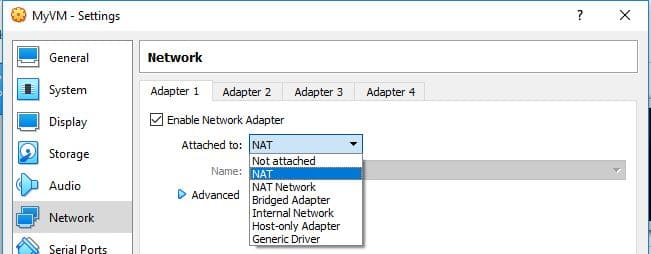

# installing-Metasploitable-in-VirtualBox

Let’s first discuss what <b>Metasploitable</b> is:
<strong>Metasploitable</strong> is a virtual machine intentionally vulnerable version of Ubuntu designed for testing security tools and demonstrating common vulnerabilities.

<b>You can check my previous post on how to install </b>
<em><a href="https://github.com/Nellyjay74/Establishing-a-virtual-Lab">"Virtual box"</a>

<h2>Installation:</h2>

<b>Step 1</b>     :<em><a href="https://sourceforge.net/projects/metasploitable/files/latest/download">"Download"</a></em> the Metasploitable file. 

Step 2: The file initially will be in zip format so we need to extract it, after extracting the file open VirtualBox.

 

Step 3: click on the <strong>New</strong> option in the Virtual box.

now a window will pop up and you will be asked to provide some details like the name of your machine, installation path, type, and version.
fill in the details like:
<ul>
 <li>Name: as per your choice</li>
<li>Path: leave as recommended</li>
<liType: Linux</li>
<li>Version: other (64-bit)</li>
 </ul>

<b>Step 4: Select the RAM you want to provide to the virtual machine. recommended (512Mb).</b>

 

<b>Step 5: Now choose the option to use an existing virtual hard disk file</b>

<b>Step 6: Configure the Network</b>
Ensure that your network settings are configured appropriately. It's recommended to use NAT or Host-only network settings to keep the VM isolated from public networks, as Metasploitable should never be exposed to untrusted networks.

 

<strong>Now locate the file that we have extracted.</strong>

<b>Step 6: Now save the file and you will see that the instance is created with the name you have given.</b>

 

We are good to go with the machine just press the start button from the top and wait for it to start and load the instance.

Step 7. once the instance is loaded you will be asked to provide a login name and password. By default the credentials are :
<ul
<li><strong>Default login: msfadmin</strong></ul>
<li><strong>Default password: msfadmin</strong></li>
</ul>
 

 

once you log in with credentials you will be directed to the machine and we are done with the installation process.
